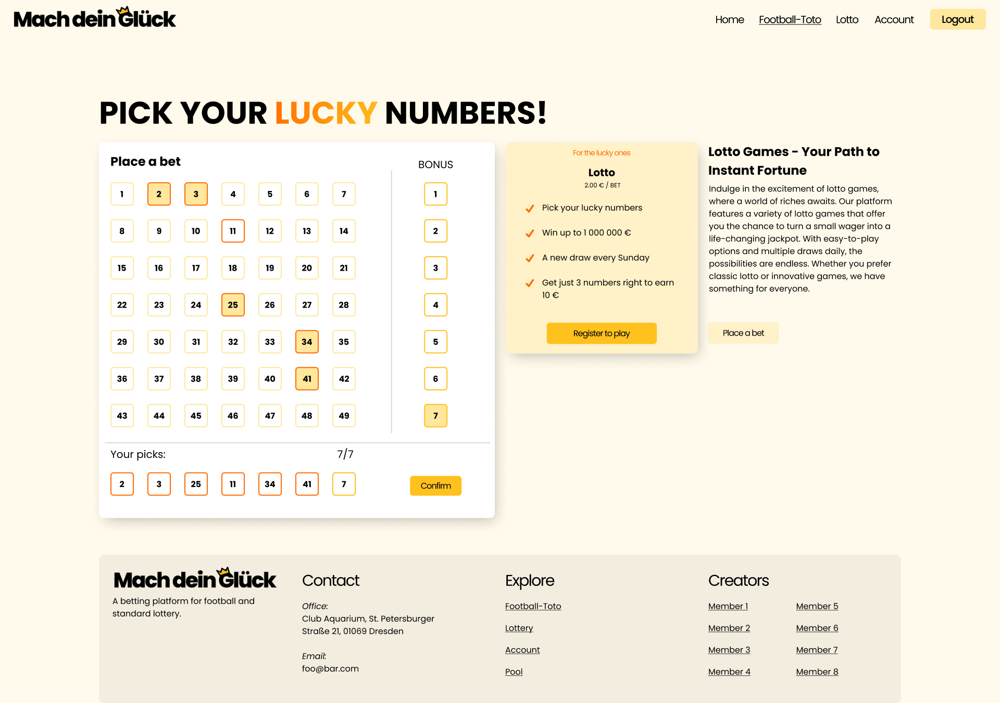
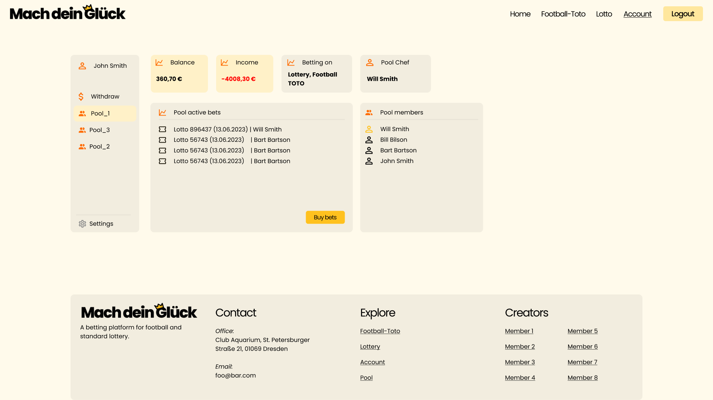
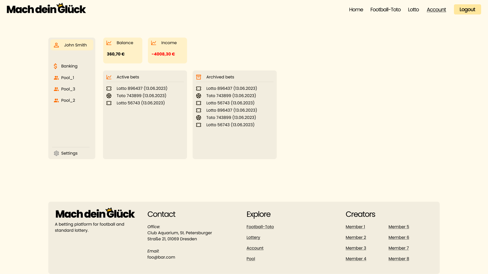

# Make your own luck

## Description
Make you own luck (_Mach dein Glück_) is a online lottery and football betting game. It was created for the TU Dresden Software Praktikum 2023/2024 university course.

The platform allows user to take part in weekly lotteries in a for of 6 numbers out of 49 with a super number and also bet on football games form the German Bundesliga 1 & 2. What's more it also allows for creation of private betting communities where the winnings are divided among the members of the betting pool.

## Purpose
The purpose of this project was to create a web application using the Spring Boot framework. The application was to be created in a team of 8 people. The project was to be managed using the Scrum methodology, with weekly sprints and a couple of development phases throughout the projects duration, including a prototyping phase, analysis phase and development phase.

In this course I gained practical knowledge of the Spring Boot Framework as well as Thymeleaf templating engine. Other than that I got to manage the whole project as a **SCRUM Master** for my group which was a challenging but valuable experience.

## Screenshots

## Authors and acknowledgment
The project was created by a team of 8 people:
- [Jakub Gawroński](https://github.com/GawronDev)
- [Juan Pablo Mancera Martínez](https://github.com/juanpablomancera)
- [Jorge Andres Picon Colmenares](https://github.com/jorgepiconjr)
- [Peter Pyshnyy](https://github.com/Peter-Pyshnyy)
- [Konrad Löhr](https://github.com/Konr4L)
- [Mareike Wischmann](https://github.com/futzelprutzel)
- [Jacob Vogler](https://github.com/Herr-Kobius)
- [Carlos Vasquez](https://github.com/Chinovm12)
