[options="header"]
[cols="1, 3, 3"]
|===
|Version | Processing Date   | Autor
|1.0	| November 12th, 2023 | ...
|===
:project_name: Lottery
:numbered:

= Developer Documentation

== Introduction and Goals
=== Task Definition

In our small neighboring country ‘Gamblien’ the state-operated lottery ‘Mach Dein Glück’ is very popular. Also owned by the state are the widespread outlets selling lottery tickets. Gambiens minister for Economic Affairs, Lottermann, is planning the start of a ‘virtual lottery’ to win over foreigners as customers as well. Beforehand the current business of the lottery and its outlets is supposed to be converted on to computers and on this basis new services shall be tested. Currently ‘Mach Dein Glück’ has a number lottery, with weekly draws, and a footballtoto. The lottery ‘Mach Dein Glück’ is a conventional lottery “6 out of 49 with additional number”. Lottery tickets are submitted at the outlet till Saturday. On Sunday the drawing takes place under strict notarization. The footballtoto refers to the upper two classes of the german Bundesliga due to the shortage of a league of its own. Lottery tickets can be submitted until 24 hours before the beginning of a match day (possibly spread over multiple match days and only ending with the last rearranged match) in Bundesliga or cup round. The number lottery offers besides single tickets also permanent lottery tickets (monthly or (semi-)annually). Lottery tickets for the footballtoto can be filled out and submitted ahead of time arbitrarily after the publication of the match calendars.

According to Minister Lottermann’s plans in future the offers shall be designed more flexible due to the new media forms:

Winning pools will be supported. When opening a new winning pool the lottery will assign a community password. Users who know this password are allowed to enter a bet for the pool and are able to assign member passwords as well. With the member password the person can increase, decrease or temporarily suspend their share (integer multiples of the base stake) until betting stops (by cash or advanced payment). Changing a bet or the betted amount is possible up to 5 minutes before a draw or the beginning of a football match day.

Instead of paying in cash henceforth the money shall be booked from bank accounts at the Lotteriebank, which every customer will open there and to which they pay cash or transfer their betted amount on time. From this bank account the betted amounts will be booked (in the order of draws). If the money is not on the account the customer will receive a notice and does not take part in the bet. For each notice a fee of 2 € will be charged. After ten notices the customer will be removed from their winning pool temporarily.

Administrators of the lottery should be able to view an overview of the submitted bets of the customers and the financial situation (winnings/loses) of the lottery, to every drawing and match day.

Minister Lottermann has published an advertisement under the reference number “MDG 2000” and asks for submissions of suitable, developable prototypes for such a system. Your SalesPoint-Team found out about this by chance and intends to enter the competition.

The lottery operator would be interested to get the data for the footballtoto directly and up-to-date from the internet. If the prototype could demonstrate that it would be seen as an advantage.

=== Quality Demands

To measure the quality of the application, quality demands have to be defined, which have to be fulfilled.

[small]_Note: The following descriptions are derived from the https://iso25000.com/index.php/en/iso-25000-standards/iso-25010[ISO/IEC 25010 Software Quality Model^]._

Maintainability::
This characteristic represents the degree of effectiveness and efficiency with which a product or system can be modified to improve it, correct it or adapt it to changes in environment, and in requirements.

Usability::
Degree to which a product or system can be used by specified users to achieve specified goals with effectiveness, efficiency and satisfaction in a specified context of use.

Security::
Degree to which a product or system protects information and data so that persons or other products or systems have the degree of data access appropriate to their types and levels of authorization.

The following table shows what quality demands have to be fulfilled to which extent.
The first column lists the quality demands, while in the following columns an "x" is used to mark the priority.

1 = Not Important ..
5 = Very Important
[options="header", cols="3h, ^1, ^1, ^1, ^1, ^1"]
|===
|Quality Demand           | 1 | 2 | 3 | 4 | 5
|Maintainability          |   |   |   | x |
|Usability                |   |   |   |   | x
|Security                 |   |   |   | x |
|===

== Constraints
=== Hardware Specifications
A list of necessary devices / hardware to run and use the application.

* Server
* Computer
* Keyboard
* Mouse

=== Software Specifications
A list of necessary software to run and use the application.

The following (or newer) Java version is necessary to run the application:

* Java 19

The following (or newer) browser versions are necessary to use the application:

* Internet Explorer / Edge 10.0
* Firefox 4.0
* Google Chrome 4.0
* Opera 9.6

=== Product Usage
This passage is going to give you an overview on how the product is planned to be used when finished and under which circumstances.

The application is going to be used as an online lottery by the lottery ‘Mach Dein Glück’ to sell lottery tickets, let customers submit their bets and find out the result of the bet, winning pools are also included in the service. The software is supposed to run on a server and be available through the internet (via a browser) to interested customers 24/7.

The primary Users of the software are adults into betting, some might not be too familiar with website navigation schemas, as well as Administrators (staff of the lottery), who do not necessarily have a technical background. Any data shall be stored persistently in a database and be accessible through the application.

== Context and Scope
=== Context Diagram
The system context diagram shows the planned system in its environment.
This includes all User types, their ways to access the system, as well as third-party systems, which
access our system or are accessed by it.

[[context_diagram]]
image::./models/analysis/context.png[context diagram, 100%, 100%, pdfwidth=100%, title= "Context diagram of the Lottery in UML", align=center]

== Solution strategy
=== Quality Demand Fulfillment
[options="header"]
|===
|Quality Demand |Solution approach
|Maintainability a|
* *Modularity* Compose the application out of discrete components such that changes of a component have less impact on other components.
* *Reusability* Ensure that components of the system can be reused by other components or systems.
* *Modifiabilty* Ensure that the application can be modified or extended without introducing errors or degrading the product quality.
|Usability a|
* *Learnability* Ensure that the system can be easily used and understood by its users. This can be realized by e.g. unambiguously describing the content of inputs with labels or tooltips.
* *User error protection / Error handling* Protect user against making errors. Invalid inputs must not lead to invalid system states.
* *User interface aesthetics* Provide a pleasing and satisfying interaction for the user.
* *Accessibility* Ensure that people with a wide range of characteristics can fully use the system. This can be realized by e.g. using suitable font sizes and color contrasts.
|Security a|
* *Confidentiality* Ensure that only data can be only accessed by people who are authorized to access them. This can be realized with _Spring Security_ and _Thymeleaf_ (`sec:authorize` - tag).
* *Integrity* Prevent unauthorized modification of data. This can be realized with _Spring Security_ (`@PreAuthorize` - annotation).
* *Accountability* Traceability of actions or event to a unambiguously entity or person. For this application, every `Bet` should be linked to a `User`.
|===
=== User interface
[[dialog_diagramm]]
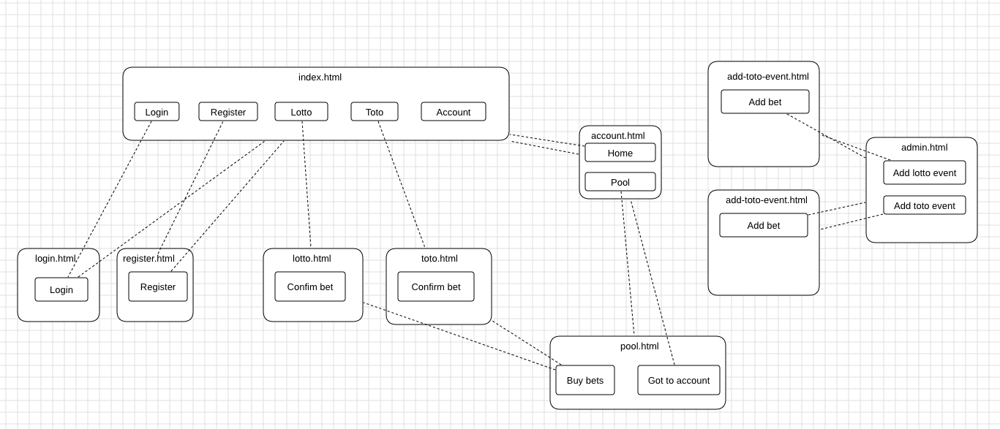

=== Software Architcture

[[container_diagram]]
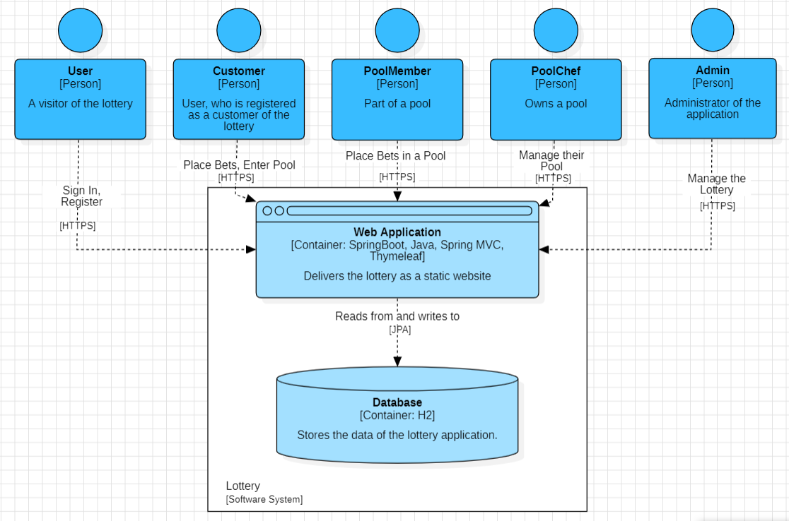

[[client_server_model]]
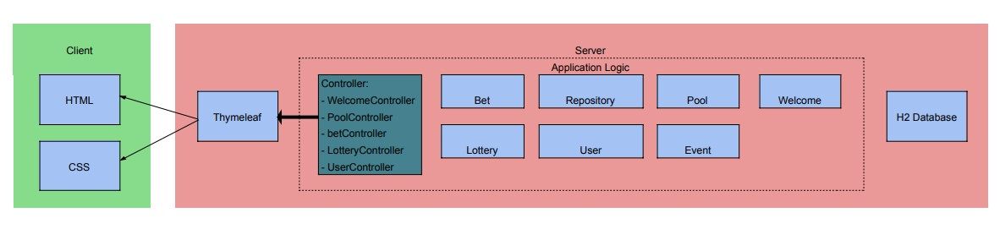

*Explanation:* HTML-Templates are rendered clientside with their corresponding CSS-Stylesheets. The data shown in the templates is provided by Thymeleaf. Thymeleaf receives the requested data by the controller classes, which are implemented in the backend. These controller classes on the other hand use instances and methods of the model classes. By default, an underlying H2 database saves data persistently.

[[top_level_architecture]]
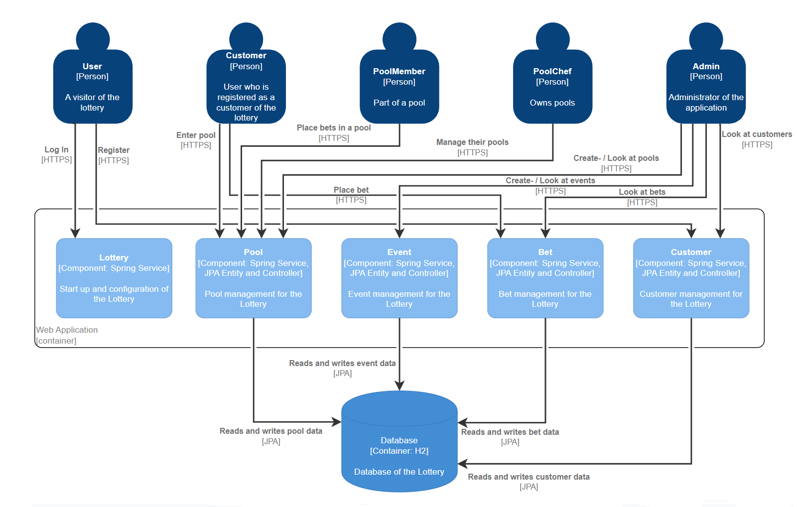

=== Use of external frameworks

[options="header"]
|===
|External Package |Used by |Why
|org.springframework.boot |
* lottery |Simple configuration of Spring application
|org.springframework.web |
* lottery
* lottery.user
* lottery.pool
* lottery.bet
* lottert.event
|Application should be provided as a static website
|org.springframework.security |
* lottery
* lottery.user
* lottery.pool
* lottery.bet
* lottert.event
|Security features for the videoshop application and authorization of website access
|org.springframework.data |
* lottery.user
* lottery.pool
* lottery.bet
* lottert.event
|JPA connection utility to the database layer
|org.salespointframework |
* lottery
* lottery.user
* lottery.pool
* lottery.bet
* lottert.event
|Reuse of SalesPoints POS functionality
|===

== Building block view
=== Package-Diagramm

=== User
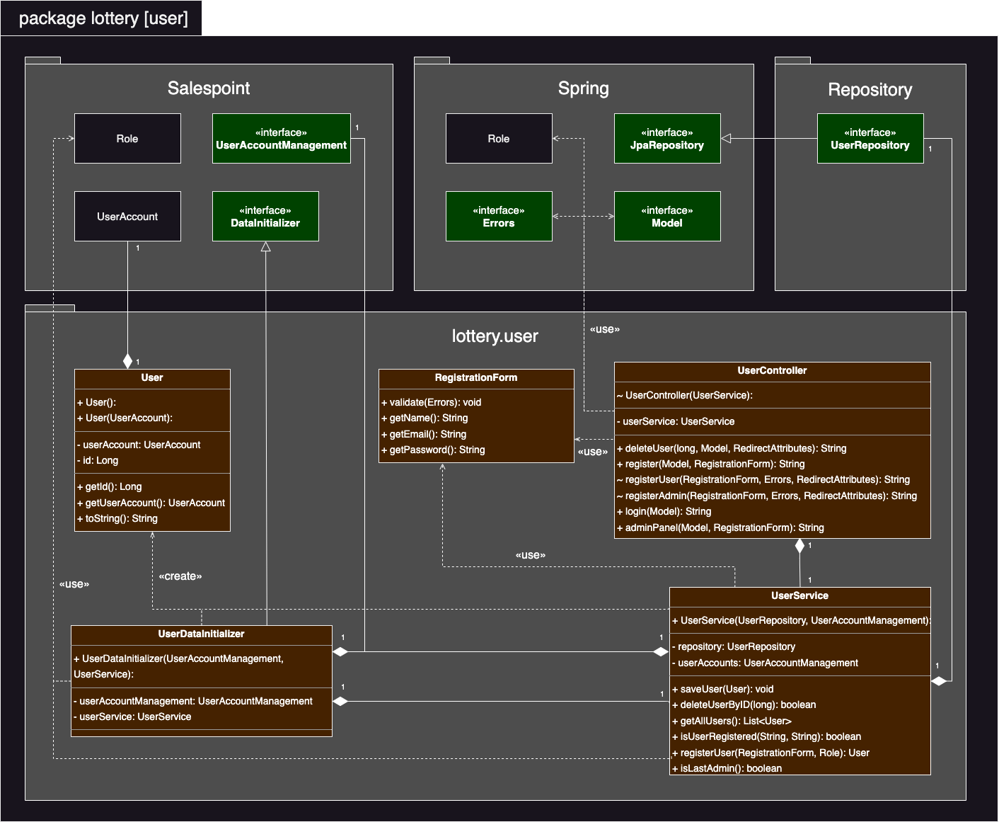
[options="header"]
|===
|Class/Enumeration |Description
|User|Custom class to extend the Salespoint-UserAccount with an unique id
|UserController|A Spring MVC Controller to handle requests to register, login and show users
|UserDataInitializer|An implementation of the DataInitializer to create dummy users on application startup
|UserService|Service class to manage users
|UserRepository|A repository interface to manage Users-instances
|RegistrationFrom|An interface to validate the user input of the registration formular
|===

=== Pool
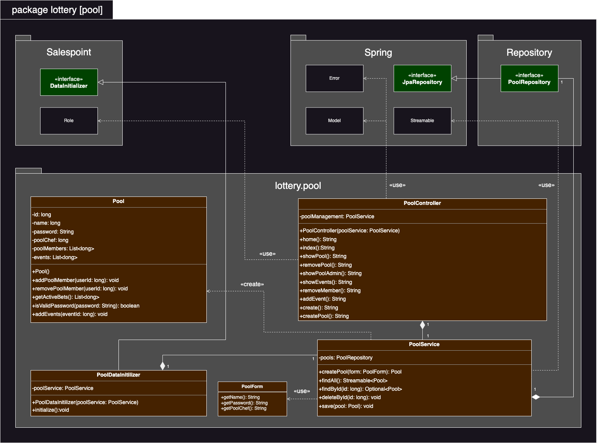
[options="header"]
|===
|Class/Enumeration |Description
|Pool|The central class of the pool package
|PoolController|A Spring MVC Controller to handle requests to creat, show and edit pools
|PoolDataInitializer|An implementation of the DataInitializer to create dummy pools on application startup
|PoolRepository|A repository interface to manage Pool-instances
|PoolFrom|An interface to validate the user input upon the creation of a new pool
|===

=== Lottery
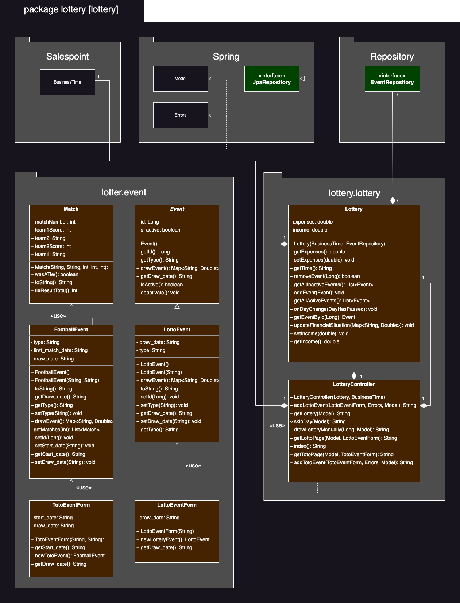
|===
|Class/Enumeration |Description
|Lottery|The central class of the lottery package
|LotteryController|A Spring MVC Controller to handle requests to create events and mange the lottery flow
|EventRepository|A repository interface to manage Event-instances
|Event| An event interface
|FootballEvent|A class to represent a football event
|LottoEvent|A class to represent a lotto event
|LottoEventForm|An interface to validate the user input upon the creation of a new lotto event
|TotoEventForm|An interface to validate the user input upon the creation of a new toto event
|Match|A class to represent a football match
|===

=== Bet
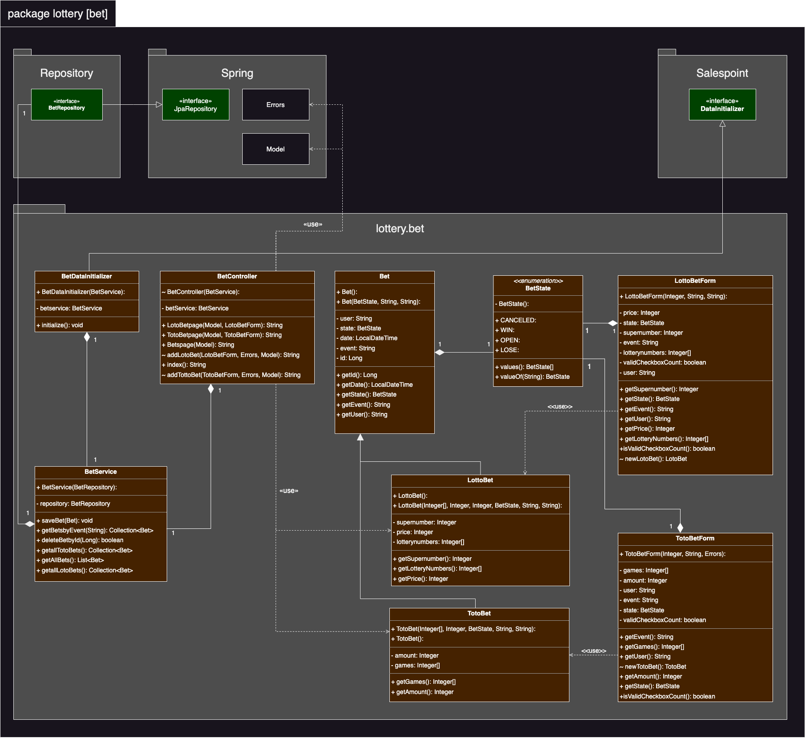
|===
|Class/Enumeration |Description
|Bet|The central class of the bet package
|BetController|A Spring MVC Controller to handle requests to create bets
|BetRepository|A repository interface to manage Bet-instances
|LottoBet|A class to represent a lotto bet
|TotoBet|A class to represent a toto bet
|LottoBetForm|An interface to validate the user input upon the creation of a new lotto bet
|TotoBetForm|An interface to validate the user input upon the creation of a new toto bet
|BetDataInitializer|An implementation of the DataInitializer to create dummy bets on application startup
|BetService|Service class to manage bets
|===

=== Traceability between Analysis- and Design Model
[small]_Note: The following table shows the Forward- and Backward Traceability from the Analysis Model to the Design Model and vice versa. Use it as a checklist to check that you did not forgot a domain concept_

[options="header"]
|===
|Class/Enumeration (Analysis Model) |Class/Enumeration (Design Model)

|Admin        		   a|
						* salespointframework.Role 						 
						* lottery.user.User
|Bet				|lottery.bet.Bet
|BetState			|lottery.bet.BetState
|Customer   		   a|
						* salespointframework.Role 						 
						* lottery.user.User 

|Event 				|lottery.event.Event
|Fußball Toto		|lottery.bet.TotoBet
|Lottery			|lottery.lottery.Lottery
|Lottery Ticket	|lottery.bet.LottoBet

|User/Registered User  a|
						* salespointframework.UserAccount

|===

== Runtime-view

=== User
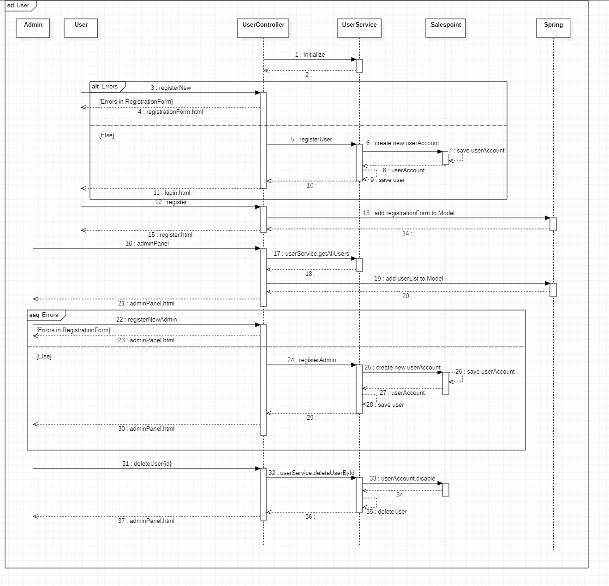

=== Pool
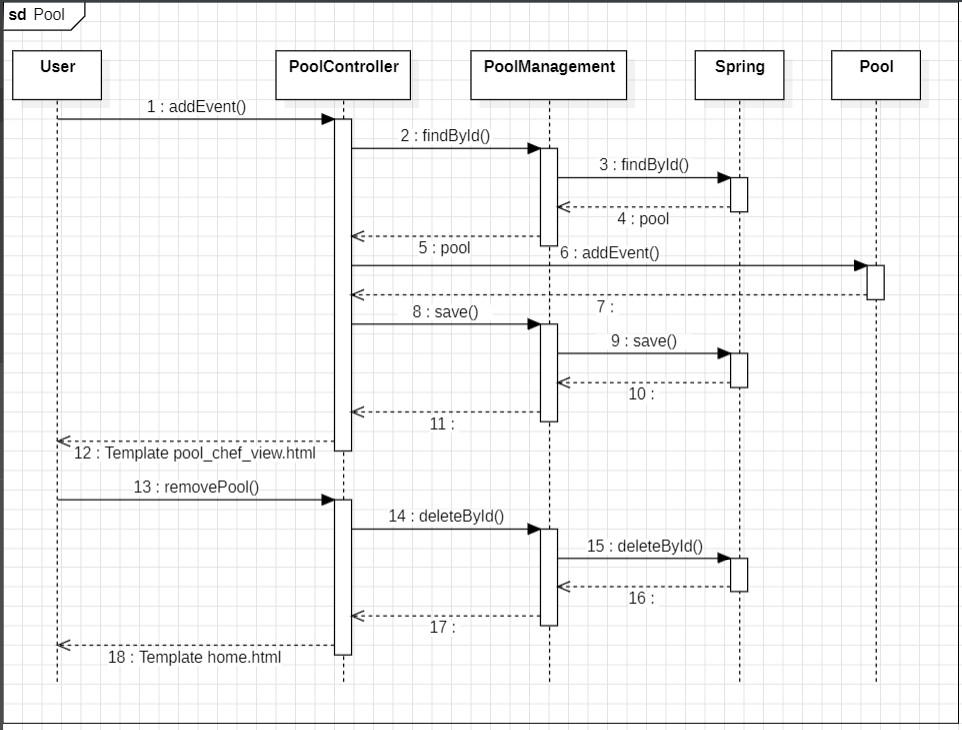

=== Event
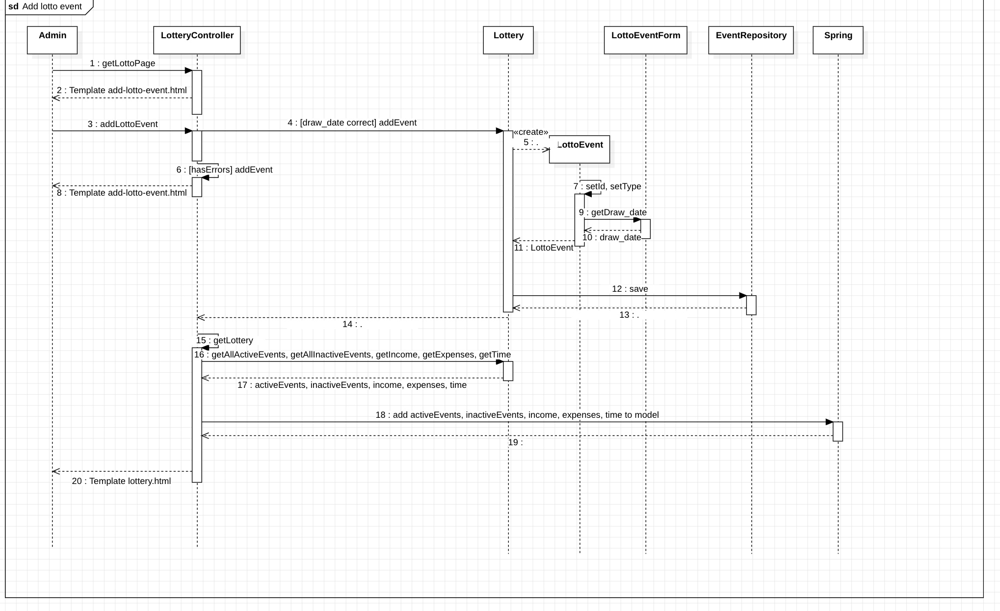

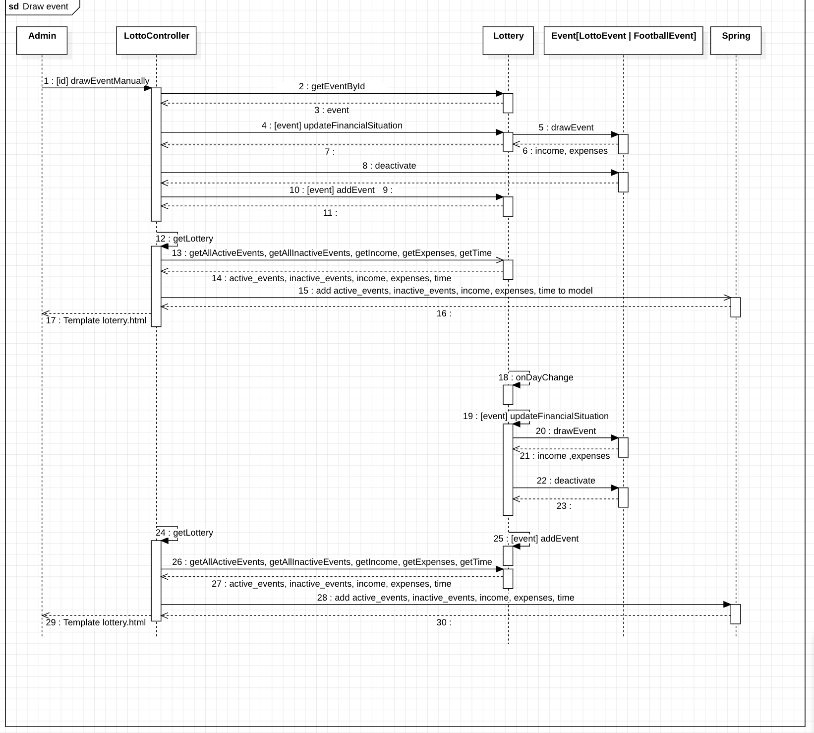

=== Bet
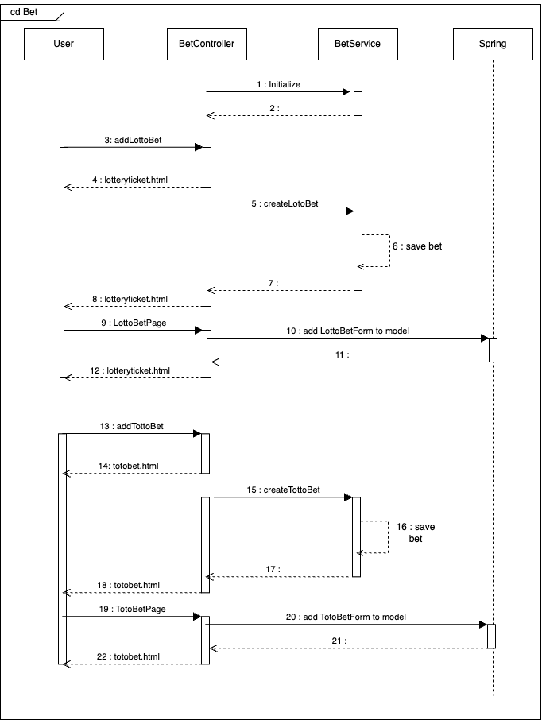

