= Pflichtenheft  
:project_name: Lotterie Mach dein Glück!!" Website
:doctype: book
:preface-title: Purpose of this Document
:toc: auto
{project_name}

[options="header"]
[cols="1, 1, 1, 1, 4"]
|===
|Version | Status      | Edit date   | Authors |  Note
|1.0     | Final   | 29.10.2023          | Author | Final Version
|===

== Purpose of this Document
The Software Requirement Specifications for the **{project_name}** are specified in this document.

The intended audiences of this document are project stakeholders, clients, and the development team. The communication between the parties is supposed to be based on the SRP and the content of this document. Furthermore, it is desired to use this document as the foundation of the contract between the contractor and client. Frequent validation and checks for consistency should be provided.

In general, the SRS should be correct, complete, and consistent. Upon delivery, the SRS is used to decide if the defined software has been delivered. After the stakeholders agree on the content of this document, changes should be kept to a minimum. Adjustments to this document should only be made to accommodate changes in requirements or changes in the environment.

[[task]]
== 1. Task Definition
In our small neighboring country ‘Gamblien’ the state-operated lottery ‘Mach Dein Glück’ is very popular. Also owned by the state are the widespread outlets selling lottery tickets. Gambiens minister for Economic Affairs, Lottermann, is planning the start of a ‘virtual lottery’ to win over foreigners as customers as well. Beforehand the current business of the lottery and its outlets is supposed to be converted on to computers and on this basis new services shall be tested. Currently ‘Mach Dein Glück’ has a number lottery, with weekly draws, and a footballtoto. The lottery ‘Mach Dein Glück’ is a conventional lottery “6 out of 49 with additional number”. Lottery tickets are submitted at the outlet till Saturday. On Sunday the drawing takes place under strict notarization. The footballtoto refers to the upper two classes of the german Bundesliga due to the shortage of a league of its own. Lottery tickets can be submitted until 24 hours before the beginning of a match day (possibly spread over multiple match days and only ending with the last rearranged match) in Bundesliga or cup round. The number lottery offers besides single tickets also permanent lottery tickets (monthly or (semi-)annually). Lottery tickets for the footballtoto can be filled out and submitted ahead of time arbitrarily after the publication of the match calendars.

According to Minister Lottermann’s plans in future the offers shall be designed more flexible due to the new media forms:

Winning pools will be supported. When opening a new winning pool the lottery will assign a community password. Users who know this password are allowed to enter a bet for the pool and are able to assign member passwords as well. With the member password the person can increase, decrease or temporarily suspend their share (integer multiples of the base stake) until betting stops (by cash or advanced payment). Changing a bet or the betted amount is possible up to 5 minutes before a draw or the beginning of a football match day.

Instead of paying in cash henceforth the money shall be booked from bank accounts at the Lotteriebank, which every customer will open there and to which they pay cash or transfer their betted amount on time. From this bank account the betted amounts will be booked (in the order of draws). If the money is not on the account the customer will receive a notice and does not take part in the bet. For each notice a fee of 2 € will be charged. After ten notices the customer will be removed from their winning pool temporarily.

Administrators of the lottery should be able to view an overview of the submitted bets of the customers and the financial situation (winnings/loses) of the lottery, to every drawing and match day.

Minister Lottermann has published an advertisement  under the reference number “MDG 2000” and asks for submissions of suitable, developable prototypes for such a system. Your SalesPoint-Team found out about this by chance and intends to enter the competition.

The lottery operator would be interested to get the data for the footballtoto directly and up-to-date from the internet. If the prototype could demonstrate that it would be seen as an advantage.

== 2. Product Usage
This passage is going to give you an overview on how the product is planned to be used when finished and under which circumstances.

The application is going to be used as an online lottery by the lottery ‘Mach Dein Glück’ to sell lottery tickets, let customers submit their bets and find out the result of the bet, winning pools are also included in the service. The software is supposed to run on a server and be available through the internet (via a browser) to interested customers 24/7.

The system shall be accessible and visually optimized for the following browsers:

- Mozilla Firefox
- Google Chrome

The primary Users of the software are adults into betting, some might not be too familiar with website navigation schemas, as well as Administrators (staff of the lottery), who do not necessarily have a technical background. Any data shall be stored persistently in a database and be accessible through the application.

[[Stakeholders]]
== 3. Stakeholders
Here is every group or individual (real or juristical) listed, which/who has an impact on the requirements of the system. In the table below these stakeholders are listed, priority is assigned (1 is the lowest and 5 the highest priority) and their high-level goals are described.

[options="header", cols="2, ^1, 4, 4"]
|===
|Name
|Priority (1..5)
|Description
|Goals

|Minister of Economic Affairs of Gamblien; Mr. Lottermann
|5
|primary client
a|
- Sell more lottery tickets
- Expand market internationally
- Move to virtual lottery
- More possibilities for customers (like winning pool)

|Customers
|4
|Primary User of the application, supposed to generate income
a|
- Usability
- Good options
- Independence from outlets
- Aesthetically pleasing
- Easy and fast to navigate
- Secure

|Administrators
|2
|Users who Administer the application (e.g. overview all bets, winning pools...)
a|
- Good overview
- Access to the customers data

|Developers
|3
|People who are either implementing the application or are responsible for maintenance later on.
a|
- Easily extendable application
- Low maintenance effort
- Good debugging mechanisms
- Understandable and readable code

|===

== 4. System Boundaries and Component Structure

=== 4.1. Context Diagram
The system context diagram shows the planned system in its environment.
This includes all User types, their ways to access the system, as well as third-party systems, which
access our system or are accessed by it.

[[context_diagram]]
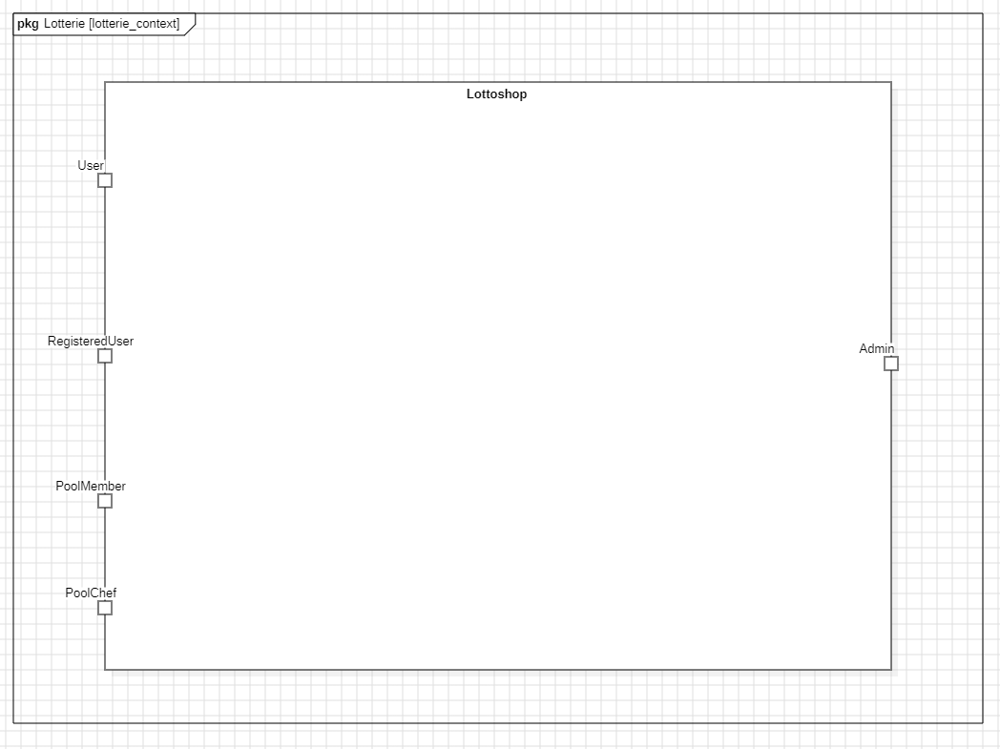

=== 4.2. Top-level architecture
Top-Level view of the system. Illustrate the major components or blocks of our system, their relationships, and interactions at a high level of abstraction. It employs blocks to represent system components, arrows to denote connections or relationships, and labels to provide additional information.

[[TLA]]
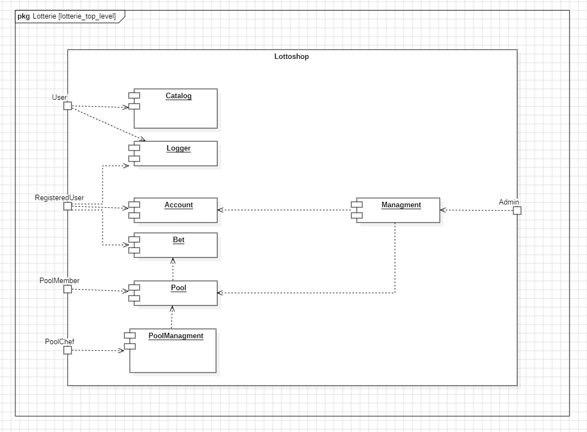

== 5. Functional Requirements
This section gives an overview of the functional requirements of the system.

=== 5.1. Must-Criteria

[options="header", cols="2h, 1, 3, 12"]
|===
|ID
|Version
|Name
|Description

|[[F0010]]<<F0010>>
|v0.1
|Authentication
a|
The system shall be able to be separated into publicly accessible parts, and parts which
require authentication to be accessed. If a User is existent in the system (<<registered_User, registered User>>), he or she shall be able to authenticate by providing the
following information:

* Email
* Password

|[[F0020]]<<F0020>>
|v0.1
|Registration
a|
The system shall provide an Unauthenticated User (<<F0010>>) the ability to register after
accessing the navigation element named "Register".

The following information has to be provided:

* Name
* Email (unique)
* Password

The system shall validate the provided data (<<F0030>>).
The User shall be registered in the system as customer and he shall be able to authenticate (<<F0010>>) after successful validation.

|[[F0021]]<<F0021>>
|v0.1
|Validate Registration
a|
The system shall be able to validate the provided data of an unregistered User.

The uniqueness of the Username has to be guaranteed.
The User shall be informed of any constraint violations.

|[[F0030]]<<F0030>>
|v0.1
|View Betting Catalog
a|
The system shall be able to provide read-only access to all available bets (<<F0010>>) through a Catalog.

|[[F0040]]<<F0040>>
|v0.1
|Place football bet
a|
The system shall provide a registered User the ability to place a football-toto bet.

|[[F0041]]<<F0041>>
|v0.1
|Choose amount for football bet
a|
The system shall provide a registered User the ability to choose the amount of his football bet.

|[[F0042]]<<F0042>>
|v0.1
|Validate football bet
a|
The system shall check if the User's account balance is non-negative, when placing a football bet. If that is not the case, the system shall provide a message informing the User that the action is not possible.
The system shall check if the time until the next play day is greater than 24 hours, when a User is placing a football bet. If that is not the case, the system shall provide a message informing the User that the action is not possible.

|[[F0050]]<<F0050>>
|v0.1
|Place a lottery bet
a|
The system shall provide a registered User the ability to choose a bet and confirm his choice.

|[[F0051]]<<F0051>>
|v0.1
|Validate lottery bet
a|
The system shall check if the User's account balance is greater than the amount the User is betting, when placing a lottery bet. If that is not the case, the system shall provide a message informing the User that the action is not possible.
The system shall check if the time until the lottery drawing is greater than 24 hours, when a User is placing a lottery bet. If that is not the case, the system shall provide a message informing the User that the action is not possible.

|[[F0060]]<<F0060>>
|v0.1
|Choose a pool bet
a|
The system shall provide a pool chef the ability to choose a bet the betting pool will take part after viewing its details.

|[[F0070]]<<F0070>>
|v0.1
|Exclude pool member
a|
The system shall provide a pool chef the ability to exclude a User from the betting pool.

|[[F0080]]<<F0080>>
|v0.1
|Select pool
a|
The system shall provide a pool member the ability to choose one of his pools in order to see its details.

|[[F0081]]<<F0081>>
|v0.1
|Place pool bet
a|
The system shall provide a pool member the ability to place a pool bet, after selecting the pool where he wants to place the bet. (<<F0081>>)
The system shall only provide as betting options (lottery/football), the ones in which the selected pool is betting.

|[[F0090]]<<F0090>>
|v0.1
|View Admin panel
a|
The system shall provide an Admin the ability to see an Admin-exclusive panel, after accesing the navigation element named "panel".

|[[F0100]]<<F0100>>
|v0.1
|View Users from Admin panel
a|
The system shall provide an Admin the functionality to view all Users who are registered in the system, after accessing "view all Users" inside the Admin panel.

|[[F0101]]<<F0101>>
|v0.1
|View User's details
a|
The system shall provide an Admin the functionality to view the details of a User, after selecting one from the Users list. (<<F0100>>)
The following information shall be shown for each User:
- Placed bets
- Financial situation (winnings/losses)
- "Delete" option (<<F0102>>)

|[[F0102]]<<F0102>>
|v0.1
|Delete User
a|
The system shall provide an Admin the functionality to delete Users

|[[F0110]]<<F0110>>
|v0.1
|View all Pools
a|
The system shall provide an Admin the functionality to view all pools.

|[[F0111]]<<F0111>>
|v0.1
|View Pool details
a|
The system shall provide an Admin the functionality to view the details of a pool, after selecting one from the pool list. (<<F0111>>)

|[[F0120]]<<F0120>>
|v0.1
|Create Pool
a|
The system shall provide an Admin the functionality to create a betting pool after request from a User. The name of the pool must be unique.

|[[F0130]]<<F0130>>
|v0.1
|Delete Pool
a|
The system shall provide an Admin the functionality to delete a betting pool, after accesing its details.

|[[F0140]]<<F0140>>
|v0.1
|Withdraw money from own account
a|
The system shall provide a User the functionality to withdraw money from his account, but only if that account's balance is positive.
The system shall notify the Admin if the amount to withdraw is bigger than the account's balance.

|[[F0141]]<<F0141>>
|v0.1
|Withdraw money from User's account
a|
The system shall provide an Admin the functionality to withdraw money from a User's account, but only if that account's balance is positive.
The system shall notify the Admin if the amount to withdraw is bigger than the account's balance.

|[[F0150]]<<F0150>>
|v0.1
|Deposit money on own account
a|
The system shall provide a User the functionality to deposit money into his account.

|[[F0151]]<<F0151>>
|v0.1
|Deposit money on Users account
a|
The system shall provide an Admin the functionality to deposit money into a User's account.

|[[F0160]]<<F0160>>
|v0.1
|View Finances of Business
a|
The system shall provide an Admin the functionality to view the general finances of the business.

|[[F0170]]<<F0170>>
|v0.1
|View Account
a|
The system shall provide a registered User the functionality to see the details of his account.

|[[F0180]]<<F0180>>
|v0.1
|View Bets
a|
The system shall provide a registered User the ability to see a list of all his bets.

|[[F0181]]<<F0181>>
|v0.1
|Change amount of football bet
a|
The system shall provide a registered User the ability to change the amount of his football bet, after accesing it in the list of his bets. The system shall check if the time until the football-play-day is greater then 5 minutes. If that is not the case, the systme shall provide a message informing the User that the action is not possible.

|[[F0190]]<<F0190>>
|v0.1
|Enter Pool
a|
The system shall provide a registered User the ability to enter a pool, after introducing the pool name and its password.

|[[F0191]]<<F0191>>
|v0.1
|Validate Pool details
a|
The system shall be able to validate the provided data of an registered User when entering a pool.
The User shall be informed of any constraint violations.

|[[F0200]]<<F0200>>
|v0.1
|Leave Pool
a|
The system shall provide a registered User the ability to leave pool.

|[[F0210]]<<F0210>>
|v0.1
|Enter football and lottery results
a|
The system shall provide an Admin the ability to manually enter the results from the football matches and the lottery.

|[[F0220]]<<F0220>>
|v0.1
|Add admin
a|
The system shall provide an Admin the ability to manually add another admin account by providing the following information:
- username
- password

|[[F0230]]<<F0230>>
|v0.1
|Delete admin
a|
The system shall provide an Admin the ability to manually delete another admin account.

|[[F0240]]<<F0240>>
|v0.1
|Add event
a|
The system shall provide an Admin the ability to manually add a lottery or football event.

|===

=== 5.2. Can-Criteria

[options="header", cols="2h, 1, 3, 12"]
|===
|ID
|Version
|Name
|Description

|[[F0250]]<<F0250>>
|v0.1
|Get Bundesliga Results from the internet
a|
The system can update (but is not necessary) the soccer matches results directly from the internet.

|===

== 6. Non-Functional Requirements

=== 6.1. Quality Demands

1 = Not Important ..
5 = Very Important
[options="header", cols="3h, ^1, ^1, ^1, ^1, ^1"]
|===
|Quality Demand           | 1 | 2 | 3 | 4 | 5
|Maintainability          |   |   |   | x |
|Usability                |   |   |   |   | x
|Security                 |   |   |   | x |
|===

=== 6.2. Concrete NF Requirements
:desired-uptime: 99,5%

[options="header", cols="2h, 1, 3, 12"]
|===
|ID
|Version
|Name
|Description

|[[NF0010]]<<NF0010>>
|v0.1
|Availability - uptime
a|
The system shall achieve at least **{desired-uptime}** uptime.

|[[NF0020]]<<NF0020>>
|v0.1
|Security - Password storage
a|
Passwords of Users shall only be stored as hash-values to prevent theft.

|===

== 7. GUI Prototyp

[[homepage_image]]
image::./gui/HomePage.png[HomePage, 100%, 100%, pdfwidth=100%, title= "Home page of lottery project, available both for registered and unregistered Users", align=center]

[[lotto_image]]
image::./gui/LottoLogged.png[LottoPage, 100%, 100%, pdfwidth=100%, title= "Lotto page with betting functionality for registered Users. A User picks 6 numbers and a bonus number from the table which than appear in Your Picks column. After picking all seven using the confirm button is possible", align=center]

[[football_toto_image]]
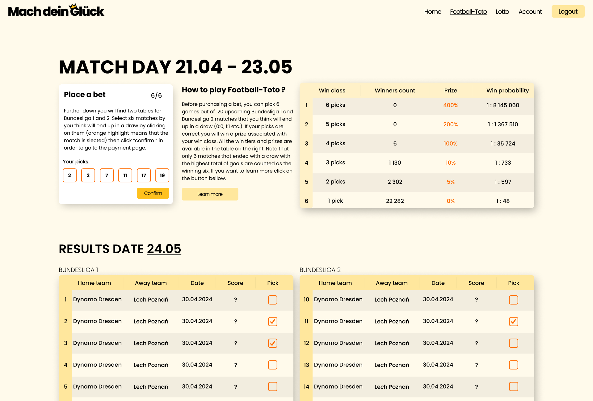

[[login_image]]
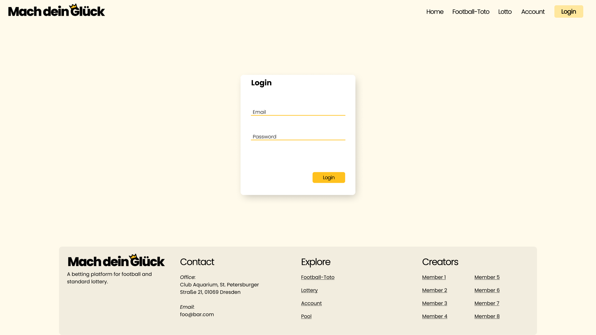

[[register_image]]
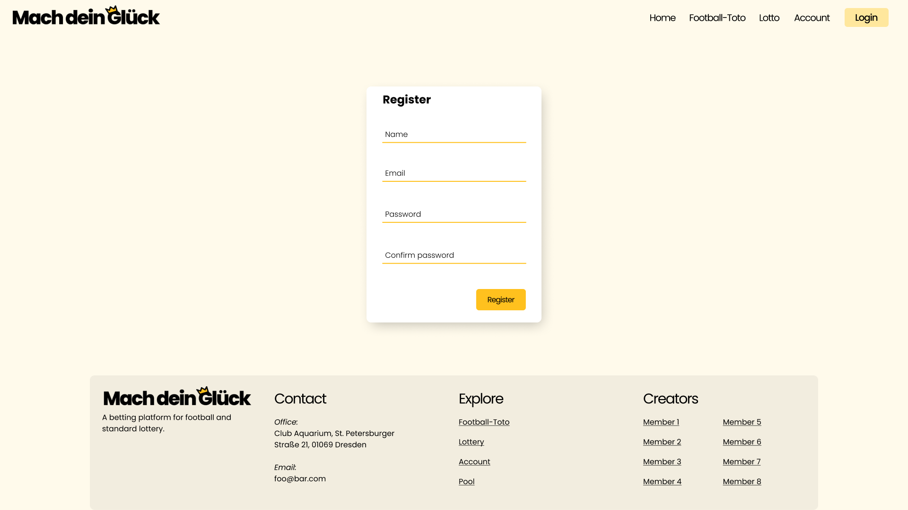

[[account_image]]
image::./gui/Account.png[Account, 100%, 100%, pdfwidth=100%, title= "Account screen. The menu on the right has the following functionality: Banking for withdrawing and depositing money (to the account balance), Pools for each betting pool that the User is member of. Income is calculated like so: money_won - money_spent. Active bets card shows bets that have been bought by the User but not yet resolved. Archived bets shows bets that have been already resolved. Users can click on bets to see the details: when was the bet placed, when was it resolved, wheather they won or lost", align=center]

[[pool_image]]
image::./gui/PoolScreen.png[Pool, 100%, 100%, pdfwidth=100%, title= "Pool screen shows the Users of the pool, the bets that have been bought by the pool and also what bets are allowed to be bought in the current draw.", align=center]

[[pool_chef_image]]
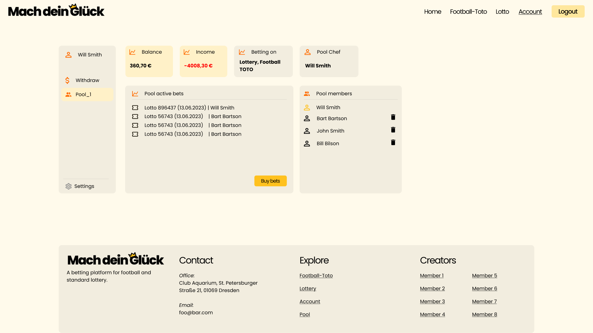

[[pool_buy_bets_image]]
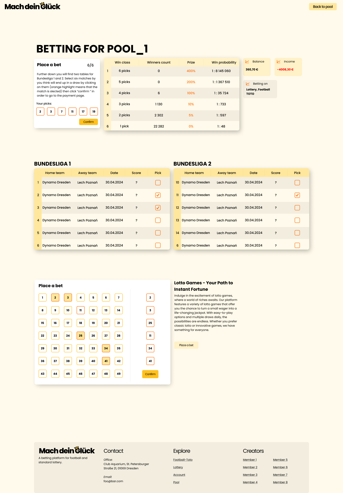

[[Admin_image]]
image::./gui/Admin.png[Admin, 100%, 100%, pdfwidth=100%, title= "Admin control panel with statistics and a list of all active Users. The actions of the left allow to either edit the Users banking account status, delete the User or edit their info. Edit lottery allows the Admin to edit the winning numbers in the incoming lottery and edit toto allows them to control the Bundesliga database.", align=center]

== 8. Data Model

=== 8.1. Class Diagram
The (analysis) class diagram is supposed to give an overview of the domain in the context of the system, which shall be developed in the scope of this project.

[[class_diagram]]
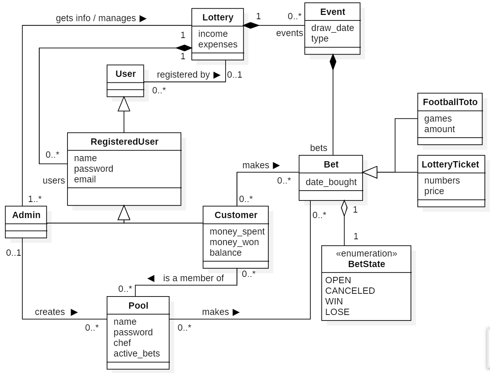

=== 8.2. Classes and Enumerations
The following table gives an overview of the classes/enumerations used in the domain model.
Therefore, this section is a subset of the <<Glossary, glossary>> and shall be used to provide every stakeholder a common understanding of central terms and concepts of the domain of the system.

// See http://asciidoctor.org/docs/User-manual/#tables
[options="header", cols="1h, 4"]
[[classes_enumerations]]
|===
|Class/Enumeration      |Description
|Lottery                  |Central class of the system representing the lottery itself.
|User | General representation of a real person.
|Registered User | General representation of a real person, which has a representation in the system. This representation is only created if a User registers with the system, and is only used if he or she authenticates.
|Customer | A User that is registered as a customer of the lottery.
|Admin | A User that is registered as an Administrator of the lottery.
|Pool | A group of customers who bet as one.
|Bet | General representation of a luck game played on the website.
|Lottery Ticket | A selection of 6 numbers chosen from a pool of 49 numbers + an extra number between 0 and 9.
|Football Toto | A collection of 20 football games to select 6 drawing games from.
|BetState | This enumeration represents the current state of the bet it belongs to. +
_OPEN_: The results of the bet are not yet registered. +
_CANCELED_: The customer was kicked from a pool after placing a bet for the pool. +
_WIN_: The results were registered and the customer picked enough correct numbers/games to win some amount of money. +
_LOSE_: The results were registered and the customer did not pick enough correct numbers/games to win any amount of money.
|Event | Representation of a lottery draw.
|===

=== 8.3. Actors

Actors are Users of the system or neighboring systems who/which access it.
The following table summarizes all actors of the system and provides a description of the actor.

[options="header"]
[cols="1,4"]
[[registered_User]]
[[actors]]
|===
|Name |Description
|User(abstract)               | Representative for every person, who interacts with the system, regardless if authenticated or not.
|Registered User / Authenticated User    | Representative for every person, who does have an account, is authenticated and interacts with the system.
|Unregistered User | Representative for unauthenticated access (i.e. unauthenticated visitors)
|Admin                | Any registered (and authenticated) User, who has the Role "Admin". Is responsible for Administration of the application.
|Pool Member             | Any registered (and authenticated) User, who has the Role "POOLMEMBER". Only the Pool Member is allowed to place bets inside the Pool.
|Pool Chef             | Any Pool Member, who has the Role "POOLCHEF". Only the Poolchef is allowed to choose which bets are bettable inside the Pool.
|===

[options="header"]
== 9. Use Cases ==

=== 9.1. Use-Case-Diagram

[[use_case_diagram]]
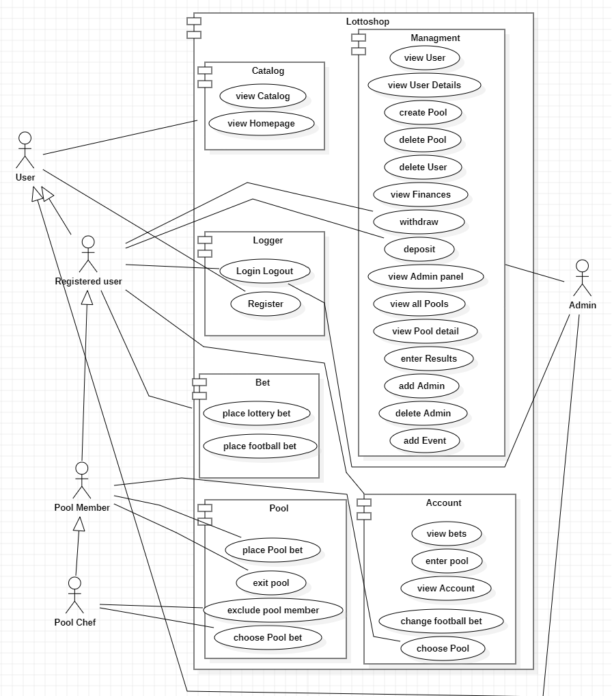

=== 9.2. Use-Case Descriptions
This section describes the use cases shown in the use case diagram in detail.

[cols="1h, 3"]
[[UC0000]]
|===
|ID                         |**<<UC0000>>**
|Name                       |view Homepage
|Description                |An unauthenticated User / any User can view the starting page (Homepage of the website.)
|Actors                     |Unauthenticated User
|Trigger                    |Unauthenticated User enters the website
|Precondition(s)           a|.
|Essential Steps           a|
1.  Unauthenticated User enters the website.
|Extensions                 |-
|Functional Requirements    |<<>>
|===

[cols="1h, 3"]
[[UC0010]]
|===
|ID                         |**<<UC0010>>**
|Name                       |Login/Logout
|Description                |A User shall be able to login (authenticate) with the system to access further functionality.
This process shall be reversible by logging out.
|Actors                     |User
|Trigger                    |
_Login_: User wants to access "hidden" functionality by logging in.

_Logout_: User wants to leave the shop.
|Precondition(s)           a|
_Login_: User is not authenticated yet

_Logout_: User is authenticated
|Essential Steps           a|
_Login_:

1. User accesses "Login" in the navigation bar
2. User enters his credentials
3. User hits "Log in" button

_Logout_:

1. User hits "Log out" in the navigation bar
2. User is unauthenticated and is shown the home screen

|Extensions                 |-
|Functional Requirements    |<<F0010>>
|===
[cols="1h, 3"]
[[UC0020]]
|===
|ID                         |**<<UC0020>>**
|Name                       |Register
|Description                |An unauthenticated User shall be able to create an account for himself.
|Actors                     |Unauthenticated User
|Trigger                    |Unauthenticated User wants to create an account for himself by pressing "Register"
|Precondition(s)           a|Actor is not logged in (authenticated) yet
|Essential Steps           a|
1.  Unauthenticated User presses "Register"
2.  He enters his desired Username, password, and delivery address
3.  System checks Username uniqueness
. If Unique: An account is created with the provided data
. Otherwise: An error message is shown
|Extensions                 |-
|Functional Requirements    |<<F0020>>, <<F0021>>
|===
[cols="1h, 3"]
[[UC0030]]
|===
|ID                         |**<<UC0030>>**
|Name                       |View catalog
|Description                |An un/authenticated User shall be able to access the betting Catalog, which displays all bets available at that time
|Actors                     |Un/Registered User
|Trigger                    |Accessing the navigation element, which is responsible for displaying the betting Catalog.
|Precondition(s)           a|
|Essential Steps           a|
1.  User clicks on the navigation element named "lottery" or "football-toto"
2.  All available bets of that type are shown in a list
|Extensions                 |-
|Functional Requirements    |<<F0030>>
|===

[cols="1h, 3"]
[[UC0040]]
|===
|ID                         |**<<UC0040>>**
|Name                       |Place football bet
|Description                |A registered User places a football-toto bet
|Actors                     |Registered User
|Trigger                    |User views the betting catalog, presses on a bet, selects  games and amount and confirms.
|Precondition(s)           a|Users account balance can not be negative and the time until the next play day is greater than 24 hours.
|Essential Steps           a|
1.  User presses on a displayed entry of the football catalog
2.  User selects the amount and the games
3.  User confirms the bet
.  If account balance is negative notification error
|Extensions                 |-
|Functional Requirements    |<<F0040>>
|===

[[sequence_diagram_place_football_bet]]
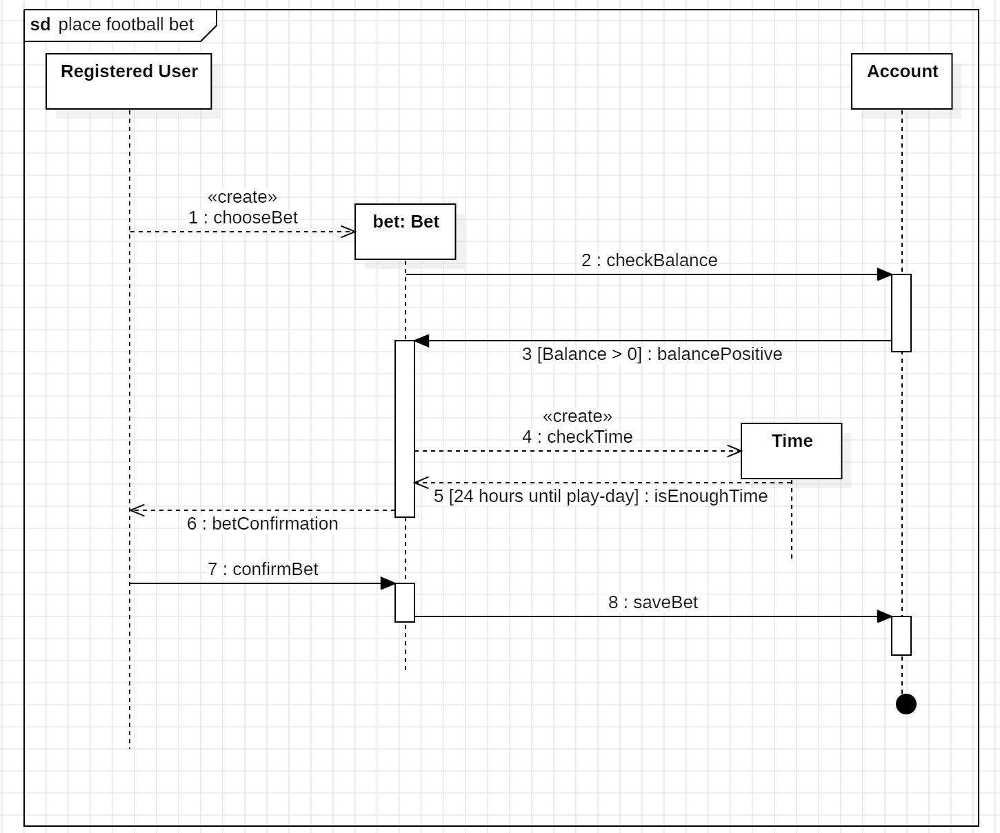

[cols="1h, 3"]
[[UC0050]]
|===
|ID                         |**<<UC0050>>**
|Name                       |Place lottery bet
|Description                |A registered User chooses a bet and confirms
|Actors                     |Registered User
|Trigger                    |User presses "place bet"
|Precondition(s)           a|Users account balance must have enough money to place the bet and the time until the lottery drawing is greater than 24 hours.
|Essential Steps           a|
1.  User has selected a bet
2.  User confirms the bet:
. If negative balance: message informing the User
|Extensions                 |-
|Functional Requirements    |<<F0050>>, <<F0051>>

|===
[[sequence_diagram_place_lottery_bet]]
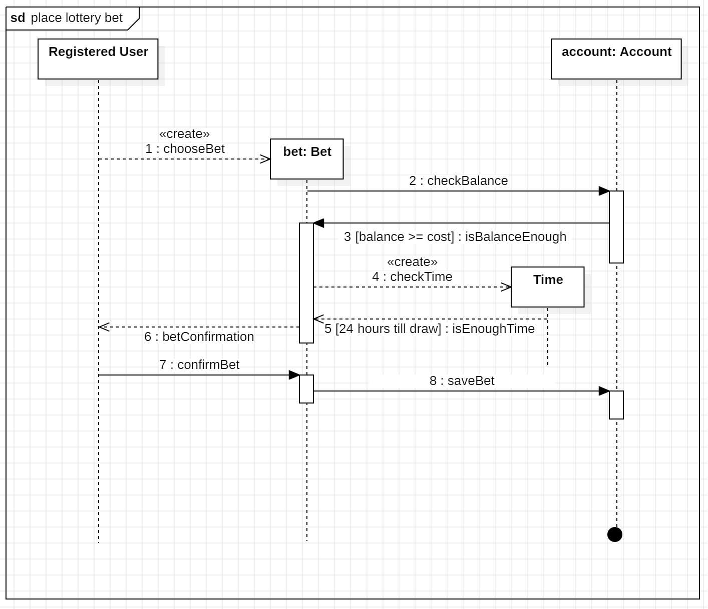
[cols="1h, 3"]
[[UC0060]]
|===
|ID                         |**<<UC0060>>**
|Name                       |Choose pool bet
|Description                |A Pool Chef chooses a bet the betting pool will take part
|Actors                     |Pool chef
|Trigger                    |Pool chef views the details of a bet and presses "add bet to {name of betting pool}"
|Precondition(s)           a|
|Essential Steps           a|
1.  Pool chef views the details of a bet
2.  Pool chef adds bet to the betting pool
|Extensions                 |-
|Functional Requirements    |<<F0060>>
|===
[cols="1h, 3"]
[[UC0070]]
|===
|ID                         |**<<UC0070>>**
|Name                       |exclude pool member
|Description                |A Pool Chef excludes a User from the betting pool
|Actors                     |Pool chef
|Trigger                    |Pool chef presses "exclude" on pool member
|Precondition(s)           a|
|Essential Steps           a|
1.  Pool chef chooses pool
2.  Pool chef selects pool member from pool
3.  Pool chef presses "exclude"
4.  Pool member is excluded
|Extensions                 |-
|Functional Requirements    |<<F0070>>
|===
[cols="1h, 3"]
[[UC0080]]
|===
|ID                         |**<<UC0080>>**
|Name                       |place pool bet
|Description                |A Pool member chooses a pool, presses "buy bets", select what to bet (lottery/football) and confirms.
|Actors                     |Pool member
|Trigger                    |Pool member presses "buy bets" after choosing a pool
|Precondition(s)           a|
|Essential Steps           a|
1.  Pool member chooses a pool
2.  Pool member presses "buy bets"
3.  Pool member selects a bet
4.  Depending on the selected type it triggers another use case: place lottery bet/ place football bet
|Extensions                 |-
|Functional Requirements    |<<F0081>>
|===
[cols="1h, 3"]
[[UC0090]]
|===
|ID                         |**<<UC0090>>**
|Name                       |View Admin panel
|Description                |Admin accesses a panel with all the information that is only visible to the Admin
|Actors                     |Admin
|Trigger                    |Accessing the navigation "panel"
|Precondition(s)           a|
|Essential Steps           a|
1.  Admin presses "panel" on the navigation.
2.  Panel is shown to the Admin
|Extensions                 |-
|Functional Requirements    |<<F0090>>
|===
[cols="1h, 3"]
[[UC0100]]
|===
|ID                         |**<<UC0100>>**
|Name                       |View User
|Description                |Admin access a view with all the registered Users
|Actors                     |Admin
|Trigger                    |Accessing the navigation element inside the Admin panel, which is responsible for displaying all User
|Precondition(s)           a|
|Essential Steps           a|
1.  User clicks on the navigation element named "View all Users" inside the Admin panel
2.  All available bets are shown in a list
|Extensions                 |-
|Functional Requirements    |<<F0100>>
|===
[cols="1h, 3"]
[[UC0110]]
|===
|ID                         |**<<UC0110>>**
|Name                       |View User details
|Description                |Admin views the details of an User
|Actors                     |Admin
|Trigger                    |Admin presses a User from the User's list
|Precondition(s)           a|
|Essential Steps           a|
1.  Admin presses on a displayed entry of the User's list
2.  Admin is shown the details of the selected User.
|Extensions                 |-
|Functional Requirements    |<<F0101>>
|===
[cols="1h, 3"]
[[UC0120]]
|===
|ID                         |**<<UC0120>>**
|Name                       |Delete User
|Description                |Admin deletes an User
|Actors                     |Admin
|Trigger                    |Admin views the details of an User and presses "delete"
|Precondition(s)           a|
|Essential Steps           a|
1.  Admin presses on a User to see the details
2.  Admin presses "delete"
|Extensions                 |-
|Functional Requirements    |<<F0102>>
|===
[cols="1h, 3"]
[[UC0130]]
|===
|ID                         |**<<UC0130>>**
|Name                       |View all pools
|Description                |Admin access a view with all pools
|Actors                     |Admin
|Trigger                    |Accessing the navigation element inside the Admin panel, which is responsible for displaying all pools
|Precondition(s)           a|
|Essential Steps           a|
1.  User clicks on the navigation element named "View pools" inside the Admin panel
2.  All pools are shown in a list
|Extensions                 |-
|Functional Requirements    |<<F0110>>
|===
[cols="1h, 3"]
[[UC0140]]
|===
|ID                         |**<<UC0140>>**
|Name                       |View pool details
|Description                |Admin views the details of a pool
|Actors                     |Admin
|Trigger                    |Admin presses a pool from the User's list
|Precondition(s)           a|
|Essential Steps           a|
1.  Admin presses on a displayed entry of the pool's list
2.  Admin is shown the details of the selected pool.
|Extensions                 |-
|Functional Requirements    |<<F0111>>
|===
[cols="1h, 3"]
[[UC0150]]
|===
|ID                         |**<<UC0150>>**
|Name                       |Create Pool
|Description                |Admin creates a betting Pool at the request of a User
|Actors                     |Admin
|Trigger                    |Admin presses "create betting pool" on Admin panel
|Precondition(s)           a|
|Essential Steps           a|
1.  Admin presses "create betting pool"
2.  Admin fills out the data (name and password)
3.  Admin presses "confirm"
|Extensions                 |-
|Functional Requirements    |<<F0120>>
|===

[[sequence_diagram_create_pool]]
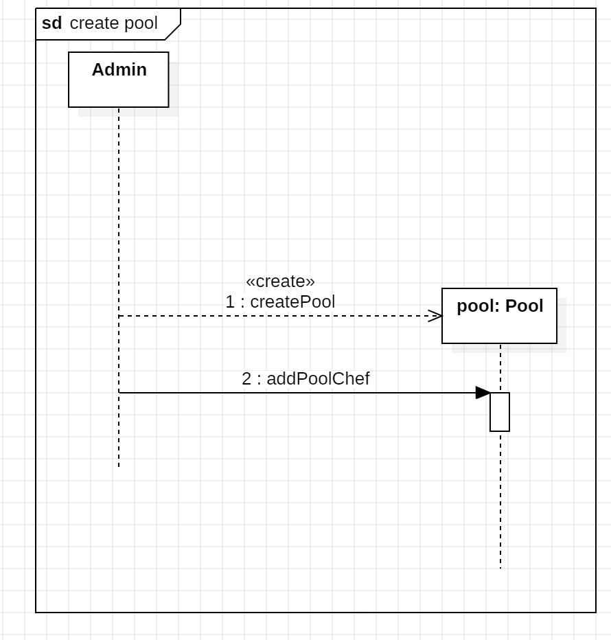
[cols="1h, 3"]
[[UC0160]]
|===
|ID                         |**<<UC0160>>**
|Name                       |Delete Pool
|Description                |Admin deletes a betting pool
|Actors                     |Admin
|Trigger                    |Admin presses "delete" in the details of a betting pool
|Precondition(s)           a|
|Essential Steps           a|
1.  Admin views a pool in detail
2.  Admin presses "delete"
|Extensions                 |-
|Functional Requirements    |<<F0130>>
|===
[cols="1h, 3"]
[[UC0170]]
|===
|ID                         |**<<UC0170>>**
|Name                       |Withdraw
|Description                |Admin/registered User withdraws money from a User's account
|Actors                     |Admin/registered User
|Trigger                    |Admin/registered User presses "withdraw" in the Account view
|Precondition(s)           a|User's account is positive
|Essential Steps           a|
1.  Admin/registered User views the Account
2.  Admin/registered User presses "withdraw"
3.  Admin/registered User selects the amount to withdraw
4.  Admin/registered User presses "confirm"
.  If the amount to withdraw is bigger than the amount in the account, notify the Admin/registered User it's not possible to execute the action
.  Else withdraw the amount from the User's account
|Extensions                 |-
|Functional Requirements    |<<F0140>>
|===
[cols="1h, 3"]
[[UC0180]]
|===
|ID                         |**<<UC0180>>**
|Name                       |Deposit
|Description                |Admin or registered User presses "deposit" in the Account view
|Actors                     |Admin/registered User
|Trigger                    |Admin/registered User presses "deposit" in the Account view
|Precondition(s)           a|
|Essential Steps           a|
1.  Admin/registered User views the Account
2.  Admin/registered User presses "deposit"
3.  Admin/registered selects the amount to deposit
4.  Admin/registered User presses "confirm"
|Extensions                 |-
|Functional Requirements    |<<F0150>>
|===

[[sequence_diagram_deposit]]
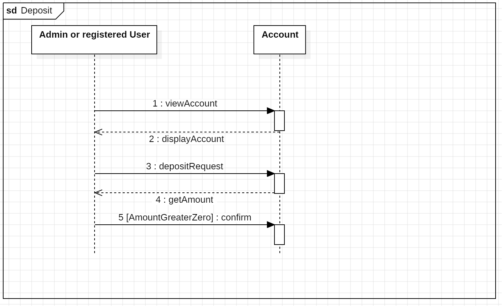
[cols="1h, 3"]
[[UC0190]]
|===
|ID                         |**<<UC0190>>**
|Name                       |View Finances
|Description                |Admin views the general state of the business
|Actors                     |Admin
|Trigger                    |Admin presses "finances" in the Admin panel
|Precondition(s)           a|
|Essential Steps           a|
1.  Admin views the Admin panel
2.  Admin presses on "view finances"
|Extensions                 |-
|Functional Requirements    |<<F0160>>
|===
[cols="1h, 3"]
[[UC0200]]
|===
|ID                         |**<<UC0200>>**
|Name                       |View account
|Description                |Registered User views a general overview of his account
|Actors                     |Registered User
|Trigger                    |Accessing the navigation element, which is responsible for displaying the account details.
|Precondition(s)           a|
|Essential Steps           a|
1.  Registered User is authenticated
2.  User presses on the navigation element called "account"
|Extensions                 |-
|Functional Requirements    |<<F0170>>
|===

[cols="1h, 3"]
[[UC0210]]
|===
|ID                         |**<<UC0210>>**
|Name                       |View bet
|Description                |Registered User views a list of all his bets
|Actors                     |Registered User
|Trigger                    |Registered User presses "view bets" in the account view
|Precondition(s)           a|
|Essential Steps           a|
1.  Registered User views the account view
2.  Registered User presses "view bets"
|Extensions                 |-
|Functional Requirements    |<<F0180>>
|===
[cols="1h, 3"]
[[UC0220]]
|===
|ID                         |**<<UC0220>>**
|Name                       |Enter Pool
|Description                |Registered User enters a pool
|Actors                     |Registered User
|Trigger                    |Pressing "enter pool" in the account view
|Precondition(s)           a|
|Essential Steps           a|
1.  Registered User views the account view
2.  Registered User presses "enter pool"
3.  Registered User enters the pool name and password in the form
4.  Registered User presses confirm
.  If data is not correct (pool name or password), Users see a message and remains outside the pool
.  Else enters the pool
|Extensions                 |-
|Functional Requirements    |<<F0190>>, <<F0191>>
|===

[[sequence_diagram_enter_pool]]
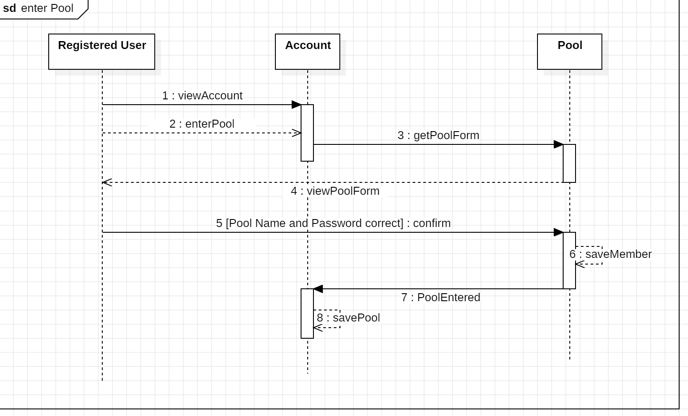
[cols="1h, 3"]
[[UC0230]]
|===
|ID                         |**<<UC0230>>**
|Name                       |Exit pool
|Description                |Registered User exits a pool
|Actors                     |Registered User
|Trigger                    |Pressing "leave pool" after choosing a pool
|Precondition(s)           a|Registered User is member of pool
|Essential Steps           a|
1.  Registered User chooses a pool
2.  Registered User presses "leave pool"
3.  Registered User is no longer a member of the pool
|Extensions                 |-
|Functional Requirements    |<<F0200>>
|===

[cols="1h, 3"]
[[UC0240]]
|===
|ID                         |**<<UC0240>>**
|Name                       |Choose pool
|Description                |Registered User
|Actors                     |Registered User chooses a pool in the account details
|Trigger                    |Pressing the pool name
|Precondition(s)           a|Registered User is member of pool
|Essential Steps           a|
1.  Registered User presses a pool
2.  Registered User sees the pool details
|Extensions                 |-
|Functional Requirements    |<<F0080>>
|===

[cols="1h, 3"]
[[UC0250]]
|===
|ID                         |**<<UC0250>>**
|Name                       |change football Bet
|Description                |Registered Users changes betting amount
|Actors                     |Registered User
|Trigger                    |Pressing "change bet" in the "view bets" view of account
|Precondition(s)           a|The time until the football-play-day is greater then 5 minutes.
|Essential Steps           a|
1.  Registered User is in account view
2.  Registered User presses "view bets"
3.  Registered User can change his bet (ammount betted)
|Extensions                 |-
|Functional Requirements    |<<F0181>>
|===

[cols="1h, 3"]
[[UC0260]]
|===
|ID                         |**<<UC0260>>**
|Name                       |enter results
|Description                |Admin enters results
|Actors                     |Admin
|Trigger                    |Pressing "enter Results" in the Admin panel
|Precondition(s)           a|
|Essential Steps           a|
1.  Admin User is in Admin panel view
2.  Admin presses "enter Results"
3.  Admin enters results and presses "confirm"
|Extensions                 |-
|Functional Requirements    |<<F0210>>
|===

[[sequence_diagram_enter_results]]
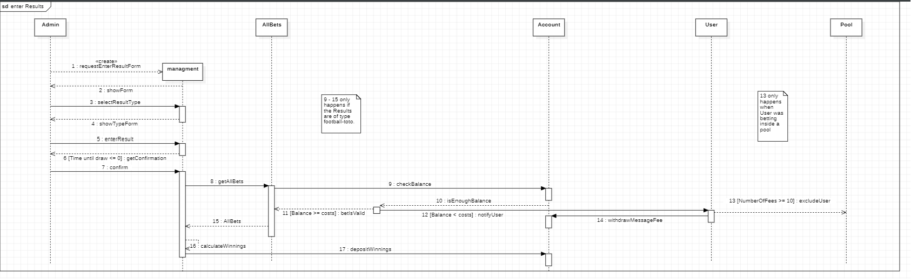

[cols="1h, 3"]
[[UC0270]]
|===
|ID                         |**<<UC0270>>**
|Name                       |add Admin
|Description                |Admin adds Admin Account
|Actors                     |Admin
|Trigger                    |Pressing "add Admin Account" in the Admin panel
|Precondition(s)           a|
|Essential Steps           a|
1.  Admin is in Admin panel view
2.  Admin presses "add Admin Account"
3.  Admin enters Username and Password
4. Admin presses Confirm
|Extensions                 |-
|Functional Requirements    |<<F0220>>
|===

[cols="1h, 3"]
[[UC0280]]
|===
|ID                         |**<<UC0280>>**
|Name                       |delete Admin
|Description                |Admin deletes Admin Account
|Actors                     |Admin
|Trigger                    |Pressing "delete Admin Account" in the Admin panel
|Precondition(s)           a|
|Essential Steps           a|
1.  Admin is in Admin panel view
2.  Admin chooses Admin Account to delete
3. Admin presses Confirm
|Extensions                 |-
|Functional Requirements    |<<F0230>>
|===

[cols="1h, 3"]
[[UC0290]]
|===
|ID                         |**<<UC0290>>**
|Name                       |add Event
|Description                |Admin adds Lottery Event (Football Toto or Lottery)
|Actors                     |Admin
|Trigger                    |Pressing "add Event" in Admin panel view
|Precondition(s)           a|
|Essential Steps           a|
1.  Admin is in Admin panel view
2.  Admin presses "add Event"
3.  Admin enters event parameters
4. Admin presses Confirm
|Extensions                 |-
|Functional Requirements    |<<F0240>>
|===

== 10. Acceptance Testing
Acceptance tests are used to determine, whether or not the delivered software system fulfills the requirements of the client during the actual usage.
The following table shows which acceptance tests the software system does have to pass at the end of the project in order to satisfy the client and complete the contract (regarding the requirements).

:Pre: Precondition(s)
:Event: Event
:Result: Expected Result

[cols="1h, 4"]
[[AT0010]]
|===
|ID            |<<AT0010>>
|Use Case      |<<UC0010>>
|{Pre}        a|The system has existing Users.
|{Event}      a|An unauthenticated User accesses the login screen, enters the credentials of an existing User of the system (name and password) and presses "Login"
|{Result}     a|
- The User is now authenticated as {name}
- The User is redirected to a welcome screen, which displays a personalized welcome message
- The User has now access to every functionality, which are accessible to Users with the role Registered User
|===
[cols="1h, 4"]
[[AT0020]]
|===
|ID            |<<AT0020>>
|Use Case      |<<UC0010>>
|{Pre}        a|An authenticated User is using the system
|{Event}      a|The authenticated User presses "Log out"
|{Result}     a|
- He becomes unauthenticated
- He loses all access to functionality only open to authenticated Users or certain roles
|===

[cols="1h, 4"]
[[AT0030]]
|===
|ID            |<<AT0030>>
|Use Case      |<<UC0020>>
|{Pre}        a|An unauthenticated User is using the system
|{Event}      a|The unauthenticated User presses "Register" in the navigation bar and enters the following information:

- _Name:_ Test
- _Password:_ 123
- _Email:_ test@tu-dresden.de

Finally, he presses "Register" to send the information.
|{Result}     a|
- A new User with the provided data is created
- It is possible to authenticate with the credentials of the created customer
- The unauthenticated User is still unauthenticated and redirected to the login page
|===

[cols="1h, 4"]
[[AT0040]]
|===
|ID            |<<AT0040>>
|Use Case      |<<UC0020>>
|{Pre}        a|An unauthenticated User is using the system
|{Event}      a|The unauthenticated User presses "Register" in the navigation bar and enters the following information:

- _Name:_ Test
- _Password:_ 123
- _Email:_ test@tu-dresden.de

Finally, he presses "Register" to send the information.
|{Result}     a|
- An error message is shown to inform the User about the problem (User already exists)
|===

[cols="1h, 4"]
[[AT0050]]
|===
|ID            |<<AT0050>>
|Use Case      |<<UC0030>>
|{Pre}        a|A User is using the system
|{Event}      a|The User presses "lottery" in the navigation bar
|{Result}     a|The User is shown an overview of the lotteries available
|===

[cols="1h, 4"]
[[AT0060]]
|===
|ID            |<<AT0060>>
|Use Case      |<<UC0030>>
|{Pre}        a|A User is using the system
|{Event}      a|The User presses "Football-Toto" in the navigation bar
|{Result}     a|The User is shown an overview of the Football-Toto
|===
[cols="1h, 4"]
[[AT0070]]
|===
|ID            |<<AT0070>>
|Use Case      |<<UC0040>>
|{Pre}        a|A User is using the system
|{Event}      a|User places a Football-Toto after choosing 6 games
|{Result}     a|The bet is created and saved to the User's account
|===
[cols="1h, 4"]
[[AT0080]]
|===
|ID            |<<AT0080>>
|Use Case      |<<UC0040>>
|{Pre}        a|A User is using the system
|{Event}      a|User places a Football-Toto after choosing 6 games
|{Result}     a|The User sees an error notification because his account state is negative
|===
[cols="1h, 4"]
[[AT0090]]
|===
|ID            |<<AT0090>>
|Use Case      |<<UC0050>>
|{Pre}        a|A User is using the system
|{Event}      a|User places a Lotto after choosing the numbers
|{Result}     a|The bet is created and saved to the User's account
|===
[cols="1h, 4"]
[[AT0100]]
|===
|ID            |<<AT0100>>
|Use Case      |<<UC0050>>
|{Pre}        a|A User is using the system
|{Event}      a|User places a Lotto after choosing the numbers
|{Result}     a|The User sees a notification error because the account balance has less money in it than the lotto price
|===
[cols="1h, 4"]
[[AT0110]]
|===
|ID            |<<AT0110>>
|Use Case      |<<UC0060>>
|{Pre}        a|A pool chef is using the system
|{Event}      a|User adds bet to betting pool
|{Result}     a|Bet is added to the betting pool and now it`s visible to all members
|===
[cols="1h, 4"]
[[AT0120]]
|===
|ID            |<<AT0120>>
|Use Case      |<<UC0060>>
|{Pre}        a|A pool chef is using the system
|{Event}      a|User adds bet to betting pool
|{Result}     a|User sees a notification error because the bet is already in the pool
|===
[cols="1h, 4"]
[[AT0130]]
|===
|ID            |<<AT0130>>
|Use Case      |<<UC0070>>
|{Pre}        a|A pool chef is using the system
|{Event}      a|User selects a member of the pool and excludes him
|{Result}     a|User sees a notification error because the bet is already in the pool
|===
[cols="1h, 4"]
[[AT0140]]
|===
|ID            |<<AT0140>>
|Use Case      |<<UC0090>>
|{Pre}        a|An Admin is using the system
|{Event}      a|Admin presses "panel" in the navigation bar
|{Result}     a|The panel is visible to the Admin
|===
[cols="1h, 4"]
[[AT0150]]
|===
|ID            |<<AT0150>>
|Use Case      |<<UC0100>>
|{Pre}        a|An Admin is in the panel
|{Event}      a|Admin presses "Users" in the navigation bar
|{Result}     a|A list with all Users is shown
|===
[cols="1h, 4"]
[[AT0160]]
|===
|ID            |<<AT0160>>
|Use Case      |<<UC0110>>
|{Pre}        a|An Admin views all the Users
|{Event}      a|Admin presses on a User
|{Result}     a|The details of the User (bets, financial status...) are shown
|===
[cols="1h, 4"]
[[AT0170]]
|===
|ID            |<<AT0170>>
|Use Case      |<<UC0120>>
|{Pre}        a|An Admin views a User in detail
|{Event}      a|Admin presses "delete"
|{Result}     a|The User is deleted
|===
[cols="1h, 4"]
[[AT0180]]
|===
|ID            |<<AT0180>>
|Use Case      |<<UC0170>>
|{Pre}        a|An Admin/registered User views account in detail
|{Event}      a|Admin/registered User selects an amount presses "withdraw"
|{Result}     a|The selected amount will be deducted from the User's account.
|===
[cols="1h, 4"]
[[AT0190]]
|===
|ID            |<<AT0190>>
|Use Case      |<<UC0170>>
|{Pre}        a|An Admin/registered User views account in detail
|{Event}      a|Admin/registered User selects an amount presses "withdraw"
|{Result}     a|Admin/registered User sees a notification error because the selected amount is bigger than the money in the account
|===
[cols="1h, 4"]
[[AT0200]]
|===
|ID            |<<AT0200>>
|Use Case      |<<UC0180>>
|{Pre}        a|An Admin/registered User views account in detail
|{Event}      a|Admin/registered User selects an amount presses "deposit"
|{Result}     a|The selected amount will be deposited on the User's account.
|===
[cols="1h, 4"]
[[AT0210]]
|===
|ID            |<<AT0210>>
|Use Case      |<<UC0130>>
|{Pre}        a|An Admin is in the panel
|{Event}      a|Admin presses "pools" in the panel
|{Result}     a|A list with all pools is shown
|===
[cols="1h, 4"]
[[AT0220]]
|===
|ID            |<<AT0220>>
|Use Case      |<<UC0190>>
|{Pre}        a|An Admin is in the panel
|{Event}      a|Admin presses "finances" in the panel
|{Result}     a|A financial overview of the business is shown
|===
[cols="1h, 4"]
[[AT0230]]
|===
|ID            |<<AT0230>>
|Use Case      |<<UC0150>>
|{Pre}        a|An Admin is in the panel
|{Event}      a|Admin fills the form to create a pool and presses confirm
|{Result}     a|The pool is created
|===
[cols="1h, 4"]
[[AT0240]]
|===
|ID            |<<AT0240>>
|Use Case      |<<UC0150>>
|{Pre}        a|An Admin is in the panel
|{Event}      a|Admin fills the form to create a pool and presses confirm
|{Result}     a|Admin sees a notification error because the pool name is already in use
|===
[cols="1h, 4"]
[[AT0250]]
|===
|ID            |<<AT0250>>
|Use Case      |<<UC0140>>
|{Pre}        a|An Admin views all the pools
|{Event}      a|Admin presses on a pool
|{Result}     a|The details of the pool (members, bets, financial status...) are shown
|===
[cols="1h, 4"]
[[AT0260]]
|===
|ID            |<<AT0260>>
|Use Case      |<<UC0160>>
|{Pre}        a|An Admin views a pool in detail
|{Event}      a|Admin presses "delete"
|{Result}     a|The pool is deleted
|===
[cols="1h, 4"]
[[AT0270]]
|===
|ID            |<<AT0270>>
|Use Case      |<<UC0260>>
|{Pre}        a|An Admin views the panel
|{Event}      a|Admin enters the data of a bet and presses "add"
|{Result}     a|The result of that bet (lotto or football) is added to the system and the money is divided among the winners
|===
[cols="1h, 4"]
[[AT0280]]
|===
|ID            |<<AT0280>>
|Use Case      |<<UC0200>>
|{Pre}        a|A User is using the system
|{Event}      a|User presses "account" in the navigation bar
|{Result}     a|The details of the account are shown
|===

[cols="1h, 4"]
[[AT0290]]
|===
|ID            |<<AT0290>>
|Use Case      |<<UC0210>>
|{Pre}        a|A User is seeing his account overview
|{Event}      a|User presses "bets"
|{Result}     a|All the User's bets are displayed
|===
[cols="1h, 4"]
[[AT0300]]
|===
|ID            |<<AT0300>>
|Use Case      |<<UC0250>>
|{Pre}        a|A User is seeing his bets
|{Event}      a|Presses a football bet, changes the amount and confirms
|{Result}     a|The amount of the bet is changed
|===
[cols="1h, 4"]
[[AT0310]]
|===
|ID            |<<AT0310>>
|Use Case      |<<UC0100>>
|{Pre}        a|A registered User is seeing his bets
|{Event}      a|Presses a football bet, changes the amount and confirms
|{Result}     a|Registered User sees a notification error because is account balance is negative
|===
[cols="1h, 4"]
[[AT0320]]
|===
|ID            |<<AT0320>>
|Use Case      |<<UC0220>>
|{Pre}        a|A registered User sees his account
|{Event}      a|Fill in the form to enter a pool (name and User) and presses confirm
|{Result}     a|Registered User enters the pool and now is visible in the pool overview
|===
[cols="1h, 4"]
[[AT0330]]
|===
|ID            |<<AT0330>>
|Use Case      |<<UC0220>>
|{Pre}        a|A registered User sees his account
|{Event}      a|Fill in the form to enter a pool (name and User) and presses "confirm"
|{Result}     a|Registered User sees a notification error because the data is not correct
|===

[cols="1h, 4"]
[[AT0340]]
|===
|ID            |<<AT0340>>
|Use Case      |<<UC0080>>
|{Pre}        a|A registered User sees his account overview
|{Event}      a|Registered User presses a pool of which he is a member and presses buy bets
|{Result}     a|Bets of the betting pool are displayed -> follows place football bet/place lottery bet user cases
|===
[cols="1h, 4"]
[[AT0350]]
|===
|ID            |<<AT0350>>
|Use Case      |<<UC0230>>
|{Pre}        a|A registered User is seeing his account overview inside a pool bet
|{Event}      a|Registered User presses "leave pool"
|{Result}     a|Registered User leaves the pool
|===
[cols="1h, 4"]
[[AT0360]]
|===
|ID            |<<AT0360>>
|Use Case      |<<UC0270>>
|{Pre}        a|An Admin sees the Admin panel
|{Event}      a|Admin fills out the  data and presses "add Admin account"
|{Result}     a|New Admin is created
|===
[cols="1h, 4"]
[[AT0370]]
|===
|ID            |<<AT0370>>
|Use Case      |<<UC0280>>
|{Pre}        a|An Admin sees the Admin panel
|{Event}      a|Admin selects Admin and presses "delete Admin account"
|{Result}     a|Admin no longer exists
|===
[cols="1h, 4"]
[[AT0380]]
|===
|ID            |<<AT0380>>
|Use Case      |<<UC0290>>
|{Pre}        a|An Admin sees the Admin panel
|{Event}      a|Admin presses "add Event", enters the data and confirms
|{Result}     a|Event is created
|===

[[Glossary]]
== Glossary

The glossary contains a list of all words and phrases used in this project that require a description to avoid misunderstandings between stakeholders.
Please also consult the list of <<actors, actors>>, the list of <<Stakeholders, stakeholders>> and the <<classes_enumerations, domain model>> for further definitions of terms.

:domain_ref: See <<classes_enumerations, Classes>>

[options="header", cols="1h, 4"]
[[glossar]]

|===
|Term                       |Description 

|Account                    |Combination of access rights, User data
|Admin                      |Account of a staff member with additional rights,  {domain_ref}
|Balance                    |Balance of a customer 
|Bet                        | {domain_ref}
|BetState                   | {domain_ref}
|Catalog                    | {domain_ref}
|Draw                       |Event that ends a betting 
|Fußballtoto                |Gambling that involves betting on the score of football games, see <<task, Task Definition>> 
|Login                      |Authentication was successful, after entering the correct credentials
|Lotto                      |Gambling that involves the drawing of numbers at random for money prize
|Lottery                    | {domain_ref}
|Lottery Ticket             |A ticket for ether Lotto or Fußballtoto,  {domain_ref}
|Pool                       | {domain_ref}
|Pool Chef                  | {domain_ref}
|Pool Member                | {domain_ref}
|Register/Registration      |Process of creating a new account in the system 
|Role                       |Role of a User (CUSTOMER, ADMIN, POOLMEBER, POOLCHEF),  {domain_ref}
|System                     |General term for the software system that has to be implemented during this project.
|User                       | {domain_ref}

|===
